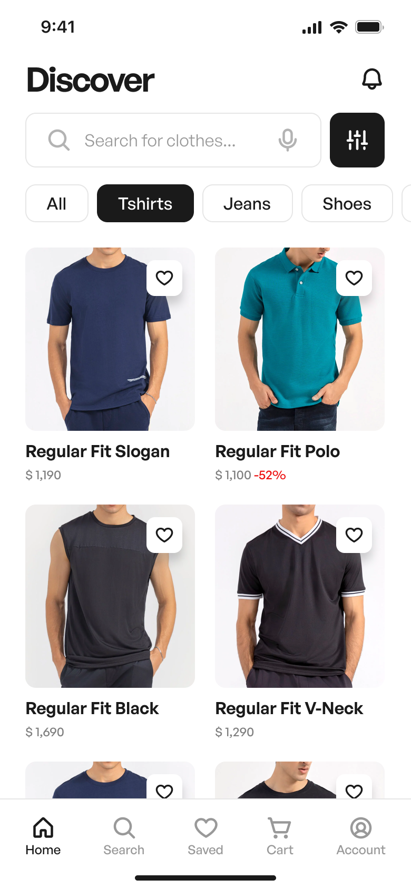
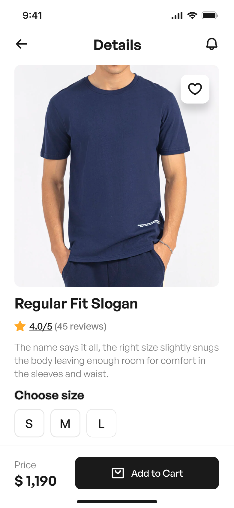
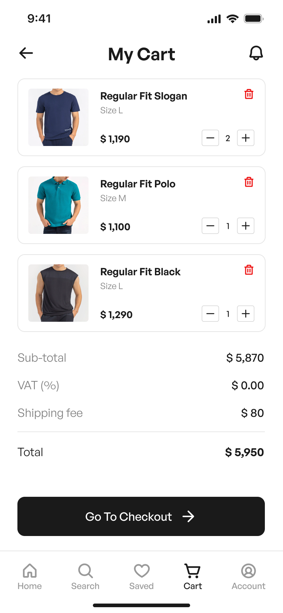
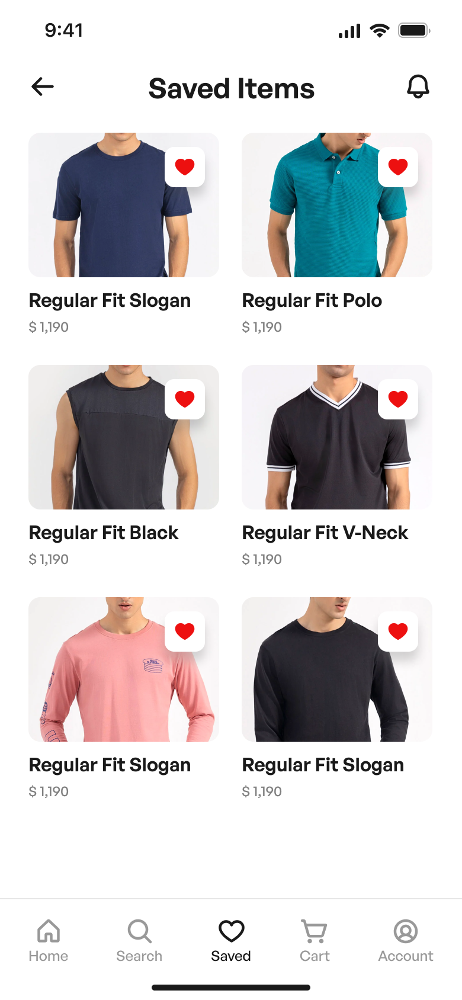
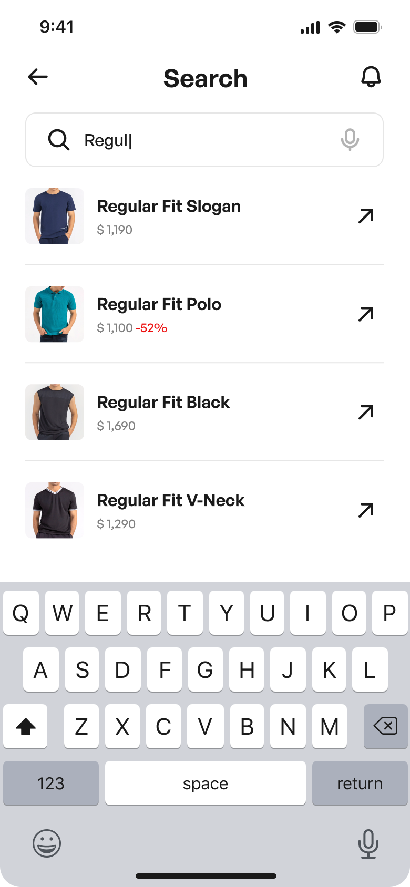
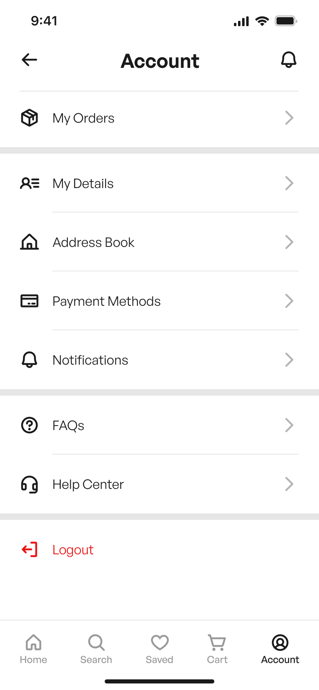
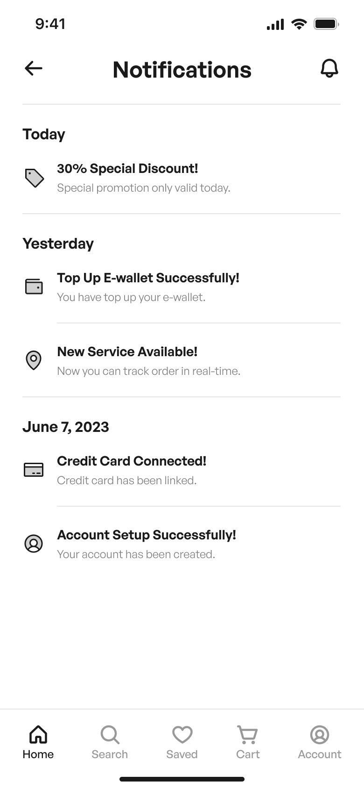
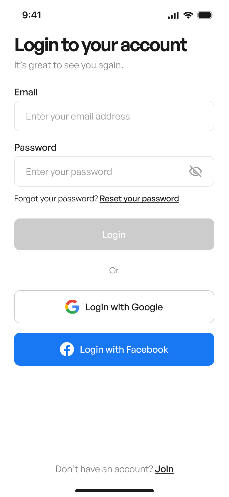
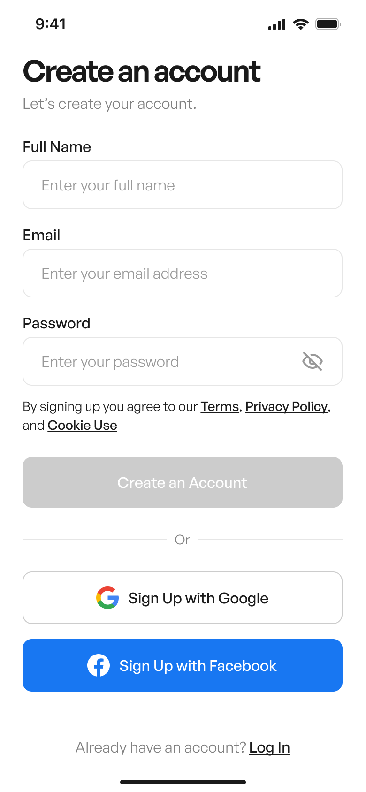

# MyStore Medusa

  

## 📌 Sobre o Projeto

**MyStore Medusa** é um projeto de estudos em **React Native** voltado para aprimorar conhecimentos avançados na construção de aplicativos mobile modernos e performáticos. O foco principal é explorar conceitos e práticas como:

- Arquitetura de frontend mobile com **React Native** e **Expo Bare Workflow**  
- Consumo de APIs e gerenciamento de dados com **Axios**  
- Gerenciamento de estado global com **Zustand**  
- Estruturas de navegação com **React Navigation 7.x**  
- Testes unitários, de integração e end-to-end com **Jest**, **React Native Testing Library** e **Maestro**  
- Padrões de código avançados, como **Custom Hooks**  
- Acessibilidade, segurança, performance e otimização de build (ex: **Re.Pack**)  

O projeto serve como **laboratório de experimentação** para aprender boas práticas e técnicas avançadas, incluindo armazenamento, sincronização offline, otimização de renderização e segurança de dados.

---

## 🎨 Design

O design do app segue o layout definido no Figma, buscando **UX/UI consistente, intuitivo e acessível**.  

| Tela | Preview |
|------|---------|
| Home |  |
| Detalhes do Produto |  |
| Carrinho |  |
| List de Desejos |  |
| Busca |  |
| Conta do Usuário |  |
| Notificações |  |
| Sign In |  |
| Sign up |  |


> **Nota:** O design do app é um UI Kit gratuito pego na comunidade do Figma .

---

## 🛠 Tecnologias Utilizadas

O projeto utiliza tecnologias e bibliotecas modernas do ecossistema React Native:

- **React Native** (com **Expo Bare Workflow**)  
- **React Navigation 7.x** para navegação entre telas  
- **Axios** para consumo de APIs  
- **Zustand** para gerenciamento de estado global  
- **Jest** + **React Native Testing Library** para testes unitários e de integração  
- **Maestro** para testes end-to-end (E2E)  
- **Custom Hooks Pattern** para lógica reutilizável e organizada  
- **Re.Pack** para otimização de build e performance  
- Outras práticas de estudo: acessibilidade (A11y), segurança de dados, performance, e técnicas de otimização de renderização  

---

## ⚙️ Funcionalidades

- Navegação entre telas de catálogo, detalhes do produto e carrinho  
- Gerenciamento de estado global com **Zustand**  
- Consumo de API Medusa (backend headless de e-commerce)  
- Estrutura de testes unitários, integração e E2E  
- Boas práticas de arquitetura e organização de código  
- Preparação para temas avançados, como armazenamento offline, caching e sincronização de dados  

---

## 🚀 Como Rodar o Projeto

1. Clone o repositório:

```bash
git clone https://github.com/LuanCassiano/mystore-medusa.git
cd mystore-medusa
```

2. Instale as dependências:

```bash
yarn install 
cd ios && pod install
```

3. Inicie o app (Expo Bare Workflow):

```bash
yarn expo run:ios
# ou
yarn expo run:android
```

4. Rodar testes:

```bash
yarn test
```
---

📚 Estudos Futuros

O projeto também serve como base para experimentação de:

 - Armazenamento offline com WatermelonDB ou alternativas

 - Técnicas avançadas de performance (lazy loading, memoization, code splitting)

 - Otimização de builds e bundles com Re.Pack

 - Estratégias de segurança e proteção de dados sensíveis

---

🤝 Contribuição

Este projeto é um laboratório pessoal de estudos, mas contribuições e sugestões de melhorias são bem-vindas!

---

📄 Licença

MIT License © 2025 Luan Cassiano